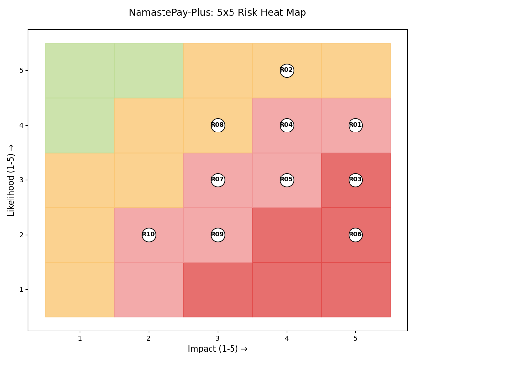

# Mapping the Chaos: A Risk Register for a Nepali FinTech Startup

*A student GRC exercise using a hypothetical startup called NamastePay*

---

I'm currently studying cybersecurity, and one of the first things my course touched on was Governance, Risk & Compliance  or GRC. Honestly, when I first heard "risk register," it sounded like something only banks with huge compliance departments would care about.

Then I started thinking about the Nepali context. We have digital payment apps growing fast, NRB tightening its Cyber Resilience Guidelines in 2026, and yet a lot of small FinTechs are probably running without a formal risk document. So I decided to try building one myself  for a hypothetical startup I'm calling **NamastePay**.

This is my first attempt. It's not perfect. But I learned a lot building it, and I want to share it with anyone else who's starting out.

---

## The Methodology: Likelihood × Impact

I used the simplest risk scoring method there is:

> **Risk Score = Likelihood (1–5) × Impact (1–5)**

| Score Range | Level |
|-------------|-------|
| 1–5 | 🟢 Low |
| 6–12 | 🟡 Medium |
| 13–19 | 🟠 High |
| 20–25 | 🔴 Critical |

I also plotted everything on a **5×5 Heat Map**. The honest truth is I struggled with some of the scores. How do you decide if something is a 3 or a 4 on likelihood? I realized you have to think about your *specific* context, not just copy scores from a textbook.

---

## The 5×5 Heat Map (Text Version)

The rows are Likelihood (5 = most likely, top), columns are Impact (1 = least impact, left → 5 = most impact, right). Each cell shows which risk(s) sit there.

- 🔴 **Critical (20–25):** R01 (4,5=20), R02 (5,4=20)
- 🟠 **High (13–19):** R03 (3,5=15), R04 (4,4=16)
- 🟡 **Medium (6–12):** R05, R06, R07, R08, R09
- 🟢 **Low (1–5):** R10

---

## The Full Risk Register

### R01  Single ISP Dependency (Internet Downtime)
**Score: 4 × 5 = 20  🔴 Critical**
**Heat Map Position: (L=4, I=5)  Danger Zone**

**Category:** Availability
**Risk Owner:** IT / Network Team
**NRB Reference:** Section 4.2  Business Continuity

> *NamastePay relies on one ISP for all payment traffic. When that ISP goes down (and in Nepal, this happens), transactions fail completely. I realized this is actually more dangerous than it sounds for a payment app — even one hour of downtime destroys customer trust.*

**Treatment:** Negotiate a secondary ISP contract (e.g., WorldLink + CG Net failover). Implement BGP load-balancing. NRB guidelines also require a Business Continuity Plan that addresses this directly.

---

### R02  Viber / WhatsApp Phishing Targeting Customers
**Score: 5 × 4 = 20  🔴 Critical**
**Heat Map Position: (L=5, I=4)  Danger Zone**

**Category:** Social Engineering
**Risk Owner:** Customer Support + Marketing
**NRB Reference:** Section 6.1 User Awareness

> *When looking at the local context, almost every Nepali uses Viber or WhatsApp. Attackers are already sending fake 'NamastePay' messages to trick customers into handing over OTPs. As a student, I think this is the most underestimated risk on the list.*

**Treatment:** In-app fraud warnings, Viber Blue Tick verification, customer SMS alerts for every transaction. Run a short Nepali-language awareness campaign on social media.

---

### R03 — NRB 2026 Reporting Non-Compliance
**Score: 3 × 5 = 15  🟠 High**
**Heat Map Position: (L=3, I=5)**

**Category:** Compliance / Regulatory
**Risk Owner:** GRC / Compliance Team
**NRB Reference:** Section 7  Incident Reporting 2026

> *NRB's 2026 cyber-resilience standards introduced stricter incident reporting windows (under 6 hours for critical events). NamastePay does not currently have an automated incident logging pipeline. A missed report = regulatory fine + possible license suspension.*

**Treatment:** Deploy a SIEM tool (even a lightweight open-source one like Wazuh). Create an Incident Response Playbook with clear escalation paths. Assign a dedicated compliance officer.

---

### R04 — Insider Threat from Under-Trained Staff
**Score: 4 × 4 = 16  🟠 High**
**Heat Map Position: (L=4, I=4)**

**Category:** Human Factor
**Risk Owner:** HR + IT Security
**NRB Reference:** Section 5.3  Human Resource Security

> *Staff who don't understand phishing, password hygiene, or data handling are a major risk vector. I noticed that many small Nepali startups skip security onboarding entirely  people just get handed a laptop and a login. That's a recipe for accidental (or even intentional) data leaks.*

**Treatment:** Mandatory quarterly security awareness training. Enforce least-privilege access control. Monitor privileged account activity with audit logs.

---

### R05 — Weak API Authentication on Mobile App
**Score: 3 × 4 = 12 — 🟡 Medium**
**Heat Map Position: (L=3, I=4)**

**Category:** Application Security
**Risk Owner:** Dev Team
**NRB Reference:** Section 3.1  Access Control

> *The NamastePay mobile API currently uses basic tokens with no rate limiting. This means brute-force or credential stuffing attacks could work. When looking at the local context, many Nepali users reuse passwords from other apps.*

**Treatment:** Implement OAuth 2.0, add rate-limiting and CAPTCHA on login, enforce multi-factor authentication for all transactions above NPR 10,000.

---

### R06 — Unencrypted Customer PII in Database
**Score: 2 × 5 = 10 — 🟡 Medium**
**Heat Map Position: (L=2, I=5)**

**Category:** Data Protection
**Risk Owner:** Dev Team + DBA
**NRB Reference:** Section 3.4  Data Protection

> *A code audit revealed that some customer PII fields (name, phone, partial card data) are stored in plaintext. If there's ever a breach, this data is immediately exposed. This one surprised me — it's a basic fix that just hasn't been prioritized yet.*

**Treatment:** Encrypt all PII fields using AES-256 at rest. Implement database access logging. Conduct a full data-flow audit quarterly.

---

### R07 No Formal Vendor / Third-Party Risk Assessment
**Score: 3 × 3 = 9 — 🟡 Medium**
**Heat Map Position: (L=3, I=3)**

**Category:** Third-Party Risk
**Risk Owner:** Procurement + IT Security
**NRB Reference:** Section 8  Third-Party Management

> *NamastePay uses third-party SDKs for KYC, payment gateway, and SMS OTP. None of these vendors have been formally assessed for security posture. A compromise in any one of them propagates directly into the app.*

**Treatment:** Create a vendor risk assessment checklist. Require security certifications (ISO 27001, PCI-DSS) from critical vendors before renewing contracts.

---

### R08 Load-Shedding Disrupting Server Uptime
**Score: 4 × 3 = 12 — 🟡 Medium**
**Heat Map Position: (L=4, I=3)**

**Category:** Physical / Environmental
**Risk Owner:** IT / Infrastructure
**NRB Reference:** Section 4.1  Physical Security

> *Load shedding is still a real issue in many parts of Nepal. If the on-premise components of the infrastructure aren't on proper UPS/generator backup, even a short power cut could cause transaction failures or data corruption during writes.*

**Treatment:** Move critical workloads to cloud (AWS Mumbai region or Azure). For any on-prem components, ensure UPS + diesel generator with at least 8-hour capacity.

---

### R09 — Insufficient Logging and Monitoring
**Score: 2 × 3 = 6 — 🟡 Medium**
**Heat Map Position: (L=2, I=3)**

**Category:** Detection & Response
**Risk Owner:** IT Security
**NRB Reference:** Section 7.1  Monitoring & Logging

> *As a student, I think this is often invisible until something goes wrong. Without proper logs, NamastePay wouldn't even know if they were being attacked. Right now there's no centralized log management — each service logs locally.*

**Treatment:** Implement centralized logging (ELK stack or Wazuh). Set up alerting thresholds. Assign someone to review security logs weekly (can be part-time initially).

---

### R10 — Weak Password Policy for Staff Accounts
**Score: 2 × 2 = 4  🟢 Low**
**Heat Map Position: (L=2, I=2)**

**Category:** Identity & Access
**Risk Owner:** IT Admin
**NRB Reference:** Section 3.1  Access Control

> *Staff accounts allow short, simple passwords with no mandatory rotation. This is a low-hanging fruit fix — but it still counts as a real risk, especially for admin accounts with elevated privileges.*

**Treatment:** Enforce minimum 12-character passwords, complexity requirements, and 90-day rotation. Deploy a password manager (Bitwarden Teams is free for small teams).

---

## Summary Table

.png>)

---

## What I Learned Building This

A few honest reflections:

**Scoring is subjective — and that's okay.** I went back and changed several scores multiple times. The point of the exercise isn't to get a "correct" number; it's to force you to *think* about each risk in context.

**Local context changes everything.** A generic risk register template wouldn't include Viber phishing or load-shedding. When I adapted it to Nepal, the register became actually useful.

**The heat map makes priorities obvious.** Seeing R01 and R02 sitting in the red zone at (4,5) and (5,4) made it immediately clear where NamastePay should focus first. You can't argue with a visual like that.

**Compliance isn't separate from security.** R03 (NRB non-compliance) taught me that regulatory risk is just another row in the same table as technical risks. GRC really does mean all three things together.

---

*This is a student exercise based on publicly available NRB Cyber Resilience Guidelines. NamastePay is entirely hypothetical. I'd love feedback from anyone working in FinTech security or GRC in Nepal — what did I miss?*

---

*#cybersecurity #GRC #Nepal #FinTech #NRB #riskmanagement #learnInPublic*
